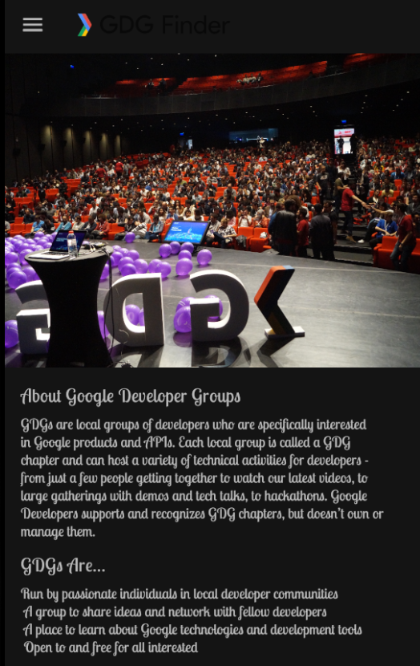
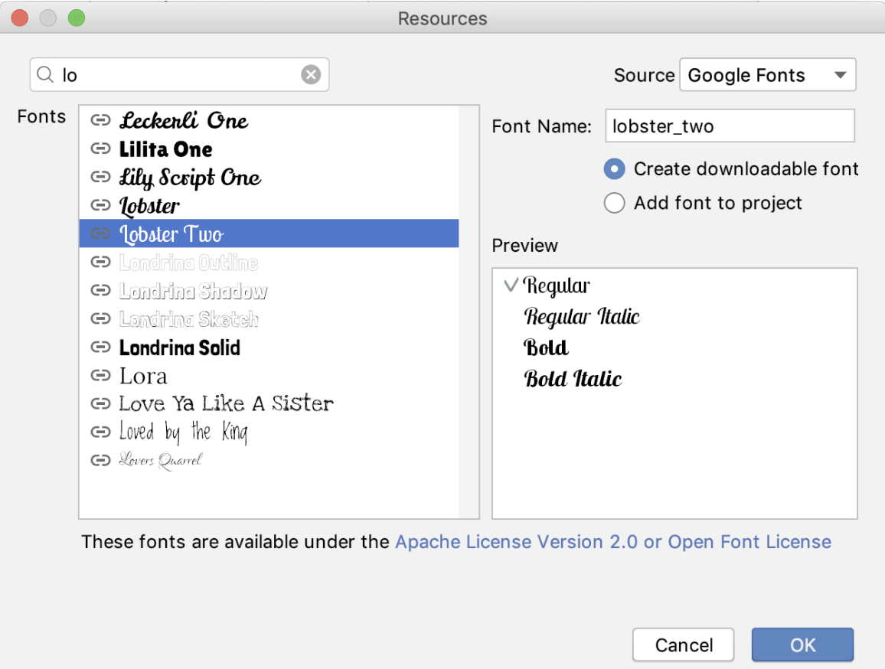
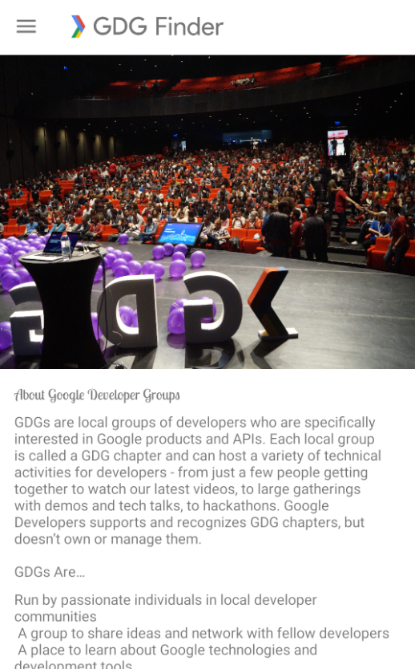
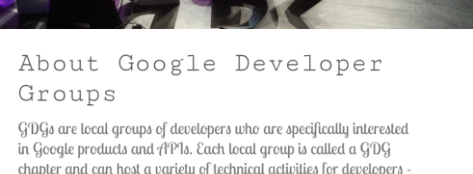

### App overview

The GDG-finder starter app builds on everything you've learned so far in this course.

The app uses ConstraintLayout to lay out three screens. Two of the screens are just layout files that you'll use to explore colors and text on Android.

The third screen is a GDG finder. GDGs, or Google Developer Groups, are communities of developers that focus on Google technologies, including Android. GDGs around the world host meetups, conferences, study jams, and other events.

As you develop this app, you work on the real list of GDGs. The finder screen uses the device's location to sort the GDGs by distance.

If you're lucky and there's a GDG in your region, you can check out the website and sign up for their events! GDG events are a great way to meet other Android developers and learn industry best practices that didn't fit in this course.

The screenshots below show how your app will change from the beginning to the end of this project.


### Android's styling system

Android provides a rich styling system that lets you control the appearance of all the views in your app. You can use themes, styles, and view attributes to affect styling. The diagram shown below summarizes the precedence of each method of styling. The pyramid diagram shows the order in which styling methods are applied by the system, from the bottom up. For example, if you set the text size in the theme, and then set the text size differently in the view attributes, the view attributes will override the theme styling.


#### View attributes

- Use view attributes to set attributes explicitly for each view. (View attributes are not reusable, as styles are.)

- You can use every property that can be set via styles or themes.

Use for custom or one-off designs such as margins, paddings, or constraints.

### Styles

- Use a style to create a collection of reusable styling information, such as font size or colors.

- Good for declaring small sets of common designs used throughout your app.

Apply a style to several views, overriding the default style. For example, use a style to make consistently styled headers or a set of buttons.

### Default style

This is the default styling provided by the Android system.

### Themes

- Use a theme to define colors for your whole app.
- Use a theme to set the default font for the whole app.
- Apply to all views, such as text views or radio buttons.
- Use to configure properties that you can apply consistently for the whole app.

### TextAppearance

- For styling with text attributes only, such as fontFamily.

When Android styles a view, it applies a combination of themes, styles, and attributes, which you can customize. Attributes always overwrite anything specified in a style or theme. And styles always overwrite anything specified in a theme.

The screenshots below show the GDG-finder app with light theme (left) and a dark theme (right), as well as with a custom font and header sizes. This can be implemented in several ways, and you learn some of them in this project.




### Task: Use attributes for styling

In this task, you use attributes to style headers for the text in the app layout.

- Download and run the [GDG-finder](https://drive.google.com/drive/folders/1lK9oGOOn5W21loLTnXjBB5JRzMXy0Vtl?usp=sharing) starter app.

- Notice that the home screen has a lot of uniformly formatted text, which makes it hard to figure out what the page is about, and what's important.

- Open the home_fragment.xml layout file.

- Notice that the layout uses ConstraintLayout to position elements inside a ScrollView.

- Notice that for each view, the constraint and margin layout attributes are set in the view, because these attributes tend to be customized for each view and screen.

- In the title text view, add a textSize attribute to change the size of the text to 24sp.

As a reminder, sp stands for scale-independent pixels, which are scaled by both the pixel density and the font-size preference that the user sets in their device settings. Android figures out how large the text should be on the screen when it draws the text. Always use sp for text sizes.

```
<TextView
       android:id="@+id/title"
...

android:textSize="24sp"
```

- Set the textColor of the title text view to opaque gray, by setting it to an aRGB value of #FF555555.

```
<TextView
       android:id="@+id/title"
...

android:textColor="#FF555555"
```

- To open the Preview tab in Android Studio, select View > Tool Windows > Preview, or click the vertical Preview button on the right edge of the Layout Editor. In the preview, verify that the title is gray and larger than it was before, as shown below.

**_Tip: An aRGB value expresses a color's alpha transparency, red value, green value, and blue value. An aRGB value uses a hexadecimal number ranging from 00 to FF for each color component._**

```
#(alpha)(red)(green)(blue)

#(00-FF)(00-FF)(00-FF)(00-FF)

Examples:

#FFFF0000 for opaque red
#5500FF00 for semi-transparent green
#FF0000FF for opaque blue
Style the subtitle to have the same color as the header, with a smaller font, 18sp. (The default alpha is FF, opaque. You can omit the alpha value if you are not changing it.)
<TextView
       android:id="@+id/subtitle"
...
android:textSize="18sp"
android:textColor="#555555"
```

In this project, the goal is to style the app to be a bit whimsical while looking professional, but you can style it any way you wish. Try the following attributes for the subtitle text view. Use the Preview tab to see how your app's appearance changes. Then remove these attributes.

```
<TextView
       android:id="@+id/subtitle"
       ...
       android:textAllCaps="true"
       android:textStyle="bold"
       android:background="#ff9999"
```

- Don't forget to undo the textAllCaps, textStyle, and background attributes from the subtitle view before you continue.

- Run your app, and it should already look better.


### Task: Use themes and downloadable fonts

When using fonts with your app, you could ship the necessary font files as part of your APK. While simple, this solution is usually not recommended, because it makes your app take longer to download and install.

Android lets apps download fonts at runtime using the Downloadable Fonts API. If your app uses the same font as another app on the device, Android only downloads the font once, saving the device's storage space.

In this task, you use downloadable fonts to set the font of every view in your app that uses the theme.

#### Step 1: Apply a downloadable font

- Open the home_fragment.xml in the Design tab.

- In the Component Tree pane, select the title text view.

- In the Attributes pane, find the fontFamily attribute. You can find it in the All Attributes section, or you can just search for it.

- Click the drop-down arrow.

- Scroll to More Fonts and select it. A Resources window opens.



- In the Resources window, search for lobster, or just lo.

- In the results, select Lobster Two.

- To the right, below the font name, select the Create downloadable font radio button. Click OK.

- Open the Android Manifest file.

- Near the bottom of the manifest, find the new <meta-data> tag with the name and resource attributes set to "preloaded_fonts". This tag tells Google Play Services that this app wants to use downloaded fonts. When your app runs and requests the Lobster Two font, the font provider downloads the font from the internet, if the font is not already available on the device.

`<meta-data android:name="preloaded_fonts" android:resource="@array/preloaded_fonts"/>`

- In the res/values folder, find the preloaded_fonts.xml file, which defines the array that lists all the downloadable fonts for this app.

- Likewise, the res/fonts/lobster_two.xml file has information about the font.

- Open home_fragment.xml and notice in the code and preview that the Lobster Two font is applied to the title TextView, and thus applied to the title.



- Open res/values/styles.xml and examine the default AppTheme theme that was created for the project. It currently looks as shown below. To apply the new Lobster Two font to all the text, you'll need to update this theme.

- In the `<style>` tag, notice the parent attribute. Every style tag can specify a parent and inherit all the parent's attributes. The code specifies the Theme defined by the Android libraries. The MaterialComponents theme that specifies everything from how buttons work to how to draw toolbars. The theme has sensible defaults, so you can customize just the parts you want. The app uses the Light version of this theme without the action bar (NoActionBar), as you can see in the screenshot above.

```
<!-- Base application theme. -->
<style name="AppTheme" parent="Theme.MaterialComponents.Light.NoActionBar">
   <!-- Customize your theme here. -->
   <item name="colorPrimary">@color/colorPrimary</item>
   <item name="colorPrimaryDark">@color/colorPrimaryDark</item>
   <item name="colorAccent">@color/colorAccent</item>
</style>
```

- Inside the AppTheme style, set the font family to lobster_two. You need to set both android:fontFamily and fontFamily, because the parent theme uses both. You can check home_fragment.xml in the Design tab to preview your changes.

```
<style name="AppTheme"
...
        <item name="android:fontFamily">@font/lobster_two</item>
        <item name="fontFamily">@font/lobster_two</item>
```

- Run the app again. The new font is applied to all the text! Open the navigation drawer and move to the other screens, and you see that the font is applied there as well.


#### Step 2: Apply the theme to the title

- In home_fragment.xml, find the title text view, which has the attribute for the lobster_two font. Delete the fontFamily attribute and run the app. Because the theme sets the same font family, there is no change.

- Put a different fontFamily attribute back into the title text view:

```
app:fontFamily="serif-monospace"
```

Make sure it's in the app space!

```
<TextView
       android:id="@+id/title"
       ...
       app:fontFamily="serif-monospace"
```

- Run the app, and you see that the attribute local to the view overrides the theme.



- Remove the fontFamily attribute from the title text view.

#### Task: Use styles

Themes are great for applying general theming to your app, such as a default font and primary colors. Attributes are great for styling a specific view and adding layout information such as margins, padding, and constraints, which tend to be specific to each screen.

In the middle of the style-hierarchy pyramid are styles. Styles are reusable "groups" of attributes that you can apply to views of your choice. In this task, you use a style for the title and subtitle.

#### Step 1: Create a style

- Open res/values/styles.xml.

- Inside the `<resources>` tag, define a new style using the `<style>` tag, as shown below.

```
<style name="TextAppearance.Title" parent="TextAppearance.MaterialComponents.Headline6">
</style>
```

It's important to think about style names as semantic when you name them. Select a style name based on what the style will be used for, not based on the properties that the style affects. For example, call this style Title, not something like LargeFontInGrey. This style will be used by any title anywhere in your app. As a convention, TextAppearance styles are called TextAppearance.Name, so in this case, the name is TextAppearance.Title.

The style has a parent, just as a theme can have a parent. But this time, instead of extending a theme, the style extends a style, TextAppearance.MaterialComponents.Headline6. This style is a default text style for the MaterialComponents theme, so by extending it you modify the default style instead of starting from scratch.

- Inside the new style, define two items. In one item, set the textSize to 24sp. In the other item, set the textColor to the same dark gray used before.

```
 <item name="android:textSize">24sp</item>
 <item name="android:textColor">#555555</item>
```

- Define another style for the subtitles. Name it TextAppearance.Subtitle.

- Because the only difference from TextAppearance.Title will be in the text size, make this style a child of TextAppearance.Title.

- Inside the Subtitle style, set the text size to 18sp. Here's the completed style:

```
<style name="TextAppearance.Subtitle" parent="TextAppearance.Title" >
   <item name="android:textSize">18sp</item>
</style>
```

#### Step 2: Apply the style that you created

- In home_fragment.xml, add the TextAppearance.Title style to the title text view. Delete the textSize and textColor attributes.

Themes override any TextAppearance styling that you set. (The pyramid diagram at the beginning of the project shows the order in which styling is applied.) Use the textAppearance property to apply the style as a TextAppearance so that the font set in the Theme overrides what you set here.

```
<TextView
       android:id="@+id/title"
       android:textAppearance="@style/TextAppearance.Title"
Also add the TextAppearance.Subtitle style to the subtitle text view, and delete the textSize and textColor attributes. You have to apply this style as a textAppearance also, so that the font set in the theme overrides what you set here.
<TextView
       android:id="@+id/subtitle"
       android:textAppearance="@style/TextAppearance.Subtitle"
```

**_Important: When you have both themes and styles manipulating text, you must apply the text properties as a textAppearance attribute if you want the text properties in the theme to override what's set and inherited in the style._**

- Run the app and your text is now consistently styled.

