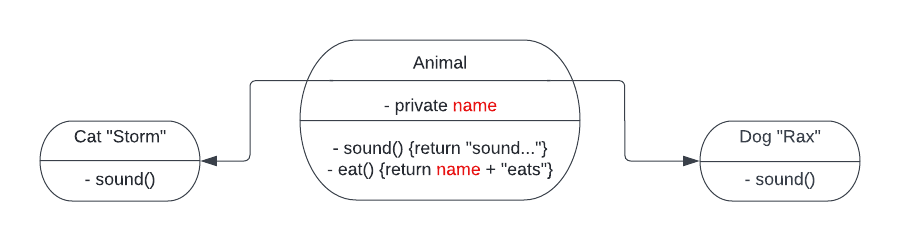

## Project structure

### JavaScript

Your directory structure should look like this:

```
├── src
|   └── animals.js
└── package.json
```

**Note**: You will be asked to create a number of classes. Make sure you `export` them using the following syntax:

```
module.exports = {class1Name, class2Name, ...}
```

**Note**: Your `package.json` should be valid. If it is a blank file then your project will not be marked as competent. If you are not sure what a valid package.json should look like, then look it up!

### Python

Your directory structure should look like this:

```
├── animals
│   └── animals.py
├── setup.py
```

### Java 

Please make use of Gradle from the command line to set up your project. You can learn more about Gradle here:



When you use gradle to create your project, give your project the following name: `animals`

Your directory structure should look like this:

```
├── app
|   ├── build.gradle
|   └── src
|       └── main
|           └── java
|               └── animals
|                   └── Animals.java <-------- names are important
|                   └── Cat.java <-------- names are important
|                   └── Dog.java <-------- names are important
|                   └── Home.java <-------- names are important
├── gradle
│   └── wrapper
│       ├── gradle-wrapper.jar
│       └── gradle-wrapper.properties
├── gradlew
├── gradlew.bat
└── settings.gradle
...
```

Make sure that all of the classes you define are within the `animals` package. Do this by including a package declaration at the top of each of your java files.

## Instructions

In this challenge, you will create 3 classes.

1. Super class called `Animal`
2. `Dog` and `Cat` class both **extend** `Animal` class (a dog is an animal, and a cat is an animal).
3. `Dog` and `Cat` class should only have one function, which is their own implementation of the `sound()` function. This is polymorphism.



```
// Java

? dog1 = new Dog()  
? dog2 = new Dog("Simba")

dog1.eat()   // public returns 'Rax eats'
dog1.sound() // returns 'Bark'

dog2.eat()   // returns 'Simba eats'
dog2.sound() // returns 'Bark'

? cat1 = new Cat()
? cat2 = new Cat("Smokey")

cat1.eat()   // returns 'Stormy eats'
cat1.sound() // returns 'Meow'

cat2.eat()   // returns 'Smokey eats'
cat2.sound() // returns 'Meow'

// Make sure all constructors, eat and sound are all public methods
```

```
// JavaScript

let dog1 = new Dog();
let dog2 = new Dog("Simba")

dog1.eat();   // returns 'Rax eats'
dog1.sound(); // returns 'Bark'

dog2.eat()   // returns 'Simba eats'
dog2.sound() // returns 'Bark'

let cat1 = new Cat();
let cat2 = new Cat("Smokey")

cat1.eat();   // returns 'Stormy eats'
cat1.sound(); // returns 'Meow'

cat2.eat()    // returns 'Smokey eats'
cat2.sound()  // returns 'Meow'

```

```

# Python

dog1 = Dog()
dog2 = Dog('Simba')

dog1.eat()   # returns 'Rax eats'
dog1.sound() # returns 'Bark'

dog2.eat()   # returns 'Simba eats'
dog2.sound() # returns 'Bark'

cat1 = Cat()
cat2 = Cat('Smokey')

cat1.eat()   # returns 'Stormy eats'
cat1.sound() # returns 'Meow'

cat2.eat()   # returns 'Smokey eats'
cat2.sound() # returns 'Meow'

```

4. Now let's add composition. Make a new class called `Home`. Lots of people have dogs and cats in their homes. `Home` should have a function called `adopt pet` that takes any `Animal` as an input and returns the number of pets that have been adopted thus far. The new pet should be stored in the `Home` object in an array/list. The `Home` object should also have a function called `make all sounds`. It should work like this:

```
// Java

Home home = new Home()
? dog1 = new Dog()
? dog2 = new Dog()
? cat = new Cat()

home.makeAllSounds() // this returns an empty ArrayList
home.adoptPet(dog1) // 1
home.makeAllSounds()
// this returns an ArrayList of Strings:
// ["Bark"]

home.adoptPet(cat) // 2
home.makeAllSounds()
// this returns an ArrayList of Strings:
// ["Bark", "Meow"]

home.adoptPet(dog2) // 3
home.makeAllSounds()
// this returns an ArrayList of Strings:
// ["Bark", "Meow", "Bark"]

// adoptPet and makeAllSounds must be public methods
```

```
// JavaScript

let home = new Home();
let dog1 = new Dog();
let dog2 = new Dog();
let cat = new Cat();


home.makeAllSounds();// this returns an empty array
home.adoptPet(dog1); // 1
home.makeAllSounds();
// this returns:
// ["Bark"]

home.adoptPet(cat); // 2
home.makeAllSounds();
// this returns:
// ["Bark", "Meow"]

home.adoptPet(dog2); // 3
home.makeAllSounds();
// this returns:
// ["Bark", "Meow", "Bark"]
```

```
# Python

home = Home()
dog1 = Dog()
dog2 = Dog()
cat = Cat()

home.make_all_sounds() // this returns an empty ArrListay
home.adopt_pet(dog1) # 1
home.make_all_sounds()
# this returns:
# ["Bark"]


home.adopt_pet(cat) # 2
home.make_all_sounds()
# this returns:
# ["Bark", "Meow"]

home.adopt_pet(dog2) # 3
home.make_all_sounds
# this returns:
# ["Bark", "Meow", "Bark"]
```

Add some functionality to `adopt pet` so that an error/exception, gets raised/thrown if you try to adopt the same pet twice. Make sure that the error has a useful message!

For example,

```
home.adoptPet(dog1) // returns the number of pets that have been adopted thus far
home.adoptPet(dog1) // an error/exception gets raised
```

## Check your understanding

Consider the following OOP concepts. Can you see and explain how they are demonstrated in this project? 

1. Encapsulation
2. Inheritance
3. Polymorphism
4. Composition

## Instructions for reviewer

- The Animal class should follow the document's diagram's instructions exactly.
- A constructor that accepts a string to set the name for the constructed pet should exist.
- The `makeAllSounds` method should return an array of the exact strings specified in the instructions. e.g "Bark", "Meow"
- All the class methods should return the exact strings defined and not print them.
- A house cannot adopt a specific instance of a pet more than once.
- Make sure any error messages are descriptive