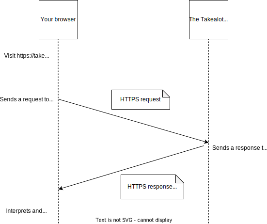

In this series of topics, we'll be talking through all the moving parts that make a web application work. We'll start off very simple and add layers of complexity over time so you can see the purpose of every piece of the puzzle.

## If you like videos

Here is a recording of a live discussion of these concepts covered in this series. This video doesn't cover all the details so it's still important to go through the content here.



## Before we begin...

Before we begin, it's worth noting that this is an oversimplification of how web apps work. We're keeping it simple so that we can teach specific lessons about how web applications work. 

Take a look at [this](https://en.wikipedia.org/wiki/Lie-to-children). 

## Once upon a time...

Here is the scenario. You need a toaster so you decide to order one online. You open up your web browser (Chrome, Firefox, Safari or whatever you use) and you navigate to your favourite online retailer's store to begin your search.

You might end up looking at something a bit like this:

What you are looking at here is a screenshot of a web browser that is looking at the Takealot home page. Takealot is South Africa's Everything store.

## The URL
 
Every website has a thing called a URL. You can see it at the top left of the picture above. 

A URL is made up of a few parts:

1. A protocol: Web browsers sometimes hide this part of the URL. The full URL for the site above is: `https://takealot.com`. The protocol is the part before the `://`. So in this case the protocol is https.
2. The domain name: The domain name can be thought of as something like a physical address. 
3. Whatever comes after the domain name. In this case, there isn't anything, but it's good to know that URLs can contain all sorts of extra information

### What's a protocol

A web protocol is like a set of rules for how computers talk to each other over the internet. You can think of it as the language computers use to communicate with each other.

Imagine writing a formal letter to the fanciest person you know. The letter would have a few parts to it, and those parts would appear in specific places. 

Some things that would appear in such a fancy-pants letter would be:

- the date
- the sender's address
- the receiver's address
- a salutation or greeting
- a subject line

A web protocol is a similar thing. It's a way of formatting digital letters that computers send to each other.

An HTTP message has a few parts to it, the main things we need to care about at this point are:

- a URL (like an address)
- a body (this is the actual message being sent)

### Didn't you say HTTPS?

The Internet is a bit of a wild place - it's made up of a LOT of computers and other devices. When a message is sent over the Internet it doesn't go straight to its destination. It gets sent from device to device until eventually, it reaches its destination.

Any device that handles a message can just read it whenever it wants to. 

HTTP is a protocol that sends messages over the Internet in plain text. HTTPS adds security - it encrypts the message so that only the destination computer can decipher and read it.

You can tell if a website is running HTTPS by interacting with the URL bar of your browser, or by looking for a little padlock symbol in the URL bar.

## Displaying the web page 

Once you type in a URL then the browser somehow figures out what to display. There are logos and colours and adverts and all sorts of interesting stuff. The browser needs to fetch that information from somewhere.

Remember when we said that a domain name is like a physical address? You can think of it as the address of a computer, that computer "serves" the website and is called a "server".

When you visit takealot.com in your browser then your browser sends an HTTPS *request* message to Takealot's server. Your browser *requests* the web page.

Takealot's server then sends an HTTPS *response* message with a whole lot of code in it. The response will be a thing called an HTML file.

HTML is a special language that is used for defining the contents of a website. Browsers understand how to visualize HTML in a human-friendly way.

So your browser, the client, requests a file from the server. The server responds with the requested file.

Your browser will then read the response and interpret the HTML. The HTML file will contain links to other resources such as image files (pictures), CSS files and JavaScript files. Your browser will just keep on requesting whatever it needs until it can draw the website.

## Terminology

We covered a lot of ground here. Let's wrap up by making sure all the terminology is defined. This is just a summary, if you need more of a deep dive on any of these terms you are encouraged to do some research on your own.

- Protocol: A set of rules and conventions that computers can follow when talking to each other
- HTTP: Hyper Text Transfer Protocol. This is used for transferring files over the internet when browsing websites. It's used in some other situations too
- HTTPS: Secure HTTP
- Server: A computer on the Internet that "serves" files upon request. Sometimes people also use the word "server" to mean the software running on a computer that allows it to serve files. 
- Client: An application that needs stuff from the server. The server serves the client. In this case, the client is your browser
- HTML: Hyper Text Markup Language. This is a simple computer language that allows you to specify the layout of a web page. Eg you can use this to say you want your website to have a heading, then a paragraph, then a picture
- CSS: Cascading Style Sheets. This is a language for adding style to HTML. With CSS you can specify the color of a heading, the size of an image and many other things
- JavaScript: This is a general-purpose programming language that can run inside a browser. Browsers can interpret HTML, CSS and JavaScript