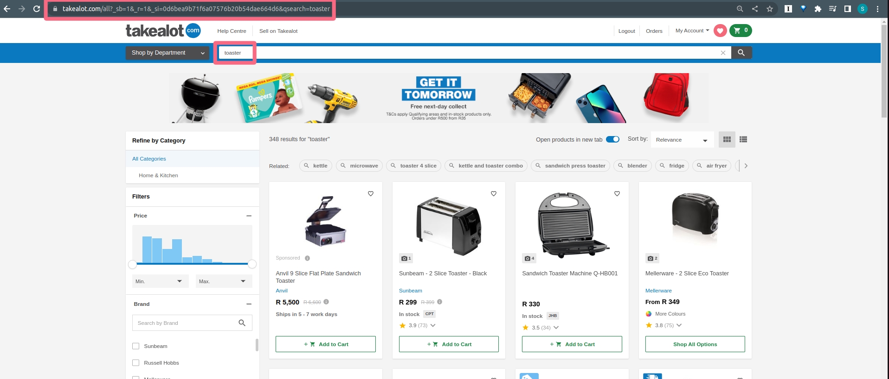
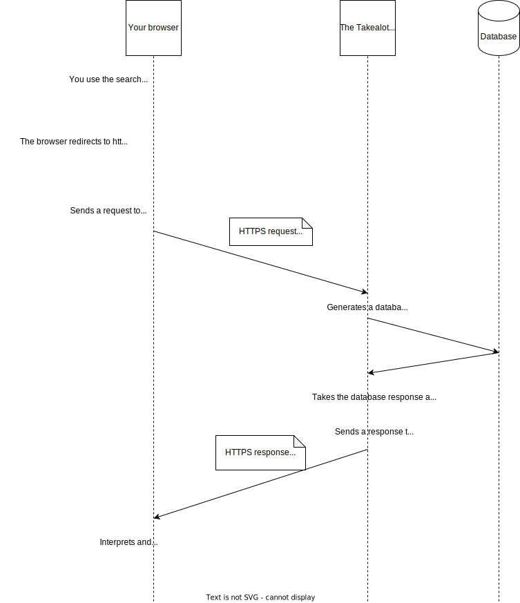

In the last part of our story, you successfully accessed the home page of an online store. You say how your browser requested a bunch of files from the server and then interpreted those files to draw a user interface.

## The story continues 

Since you are looking for a toaster, you make use of the "search" function on the website. You type in the word "toaster" and click the "search" button. 

You get redirected to a new page. It looks pretty different. 

### The URL

The first thing to notice is that the URL changed. 

- The protocol is the same
- the domain is the same
- everything after the `.com` is new

The thing to know here is that you can have extra information in a URL. So when the client (your browser) sends a request to the server it will include the entire URL in the request.

If you look closely at the URL you'll see it says `qsearch=toaster` right at the end. That's how the server will know that you are searching for a toaster. 

Let's say you want to search for something more specific such as a `smeg 4-slice toaster`. If you fill that into the search bar and then click search then the URL will show your new search terms. 

## Infinite possibilities!

In part 1 we said that the client requests files, and the server responds with the right files. Things can work like that sometimes, but the real power of the web comes from the fact that the server is smart enough to generate responses on the fly.

Takealot can't predict whether you'll search for "red smeg 4-slice toaster", "orange juice" or "CBD oil". It needs to be able to look at what you are asking for and then generate an appropriate response. 

So the Takealot server can't just store lots of HTML files on disk, it needs to be clever enough to create files on request. And it needs to "know" about all the available products so that it can figure out what to put in the response.

## Enter the Database

You can think of a database as a bunch of spreadsheets where each spreadsheet can refer to other spreadsheets.

If spreadsheets are unfamiliar to you then it would be good to play with them a bit before coming back here.

Here are some free options:

- [Google Sheets](https://www.google.com/sheets/about/) - this is a free, cloud-hosted version of Microsoft Excel
- [Airtable](https://airtable.com/invite/r/svpGJ62f) - Airtable markets itself as a low‒code platform to build next-gen apps.  It's effectively a database and an ecosystem of plugins. It's very handy

So the Takealot server has access to a database full of product information. That database is not going to be a literal spreadsheet, but you can think of the data as being arranged in rows and columns.  If you want to learn how these kinds of databases work then [here](https://www.sololearn.com/learn/courses/sql-introduction) is a good introduction.

When a request for toasters arrives at the Takealot server, then the server takes that request and it turns it into a database query, it makes use of a special programming language that the database can understand. 

The database then responds to the query with some information. The server then packages that information in a way the client (your browser) can understand and puts it into an HTTP response. 

The client then renders the response for the user.

