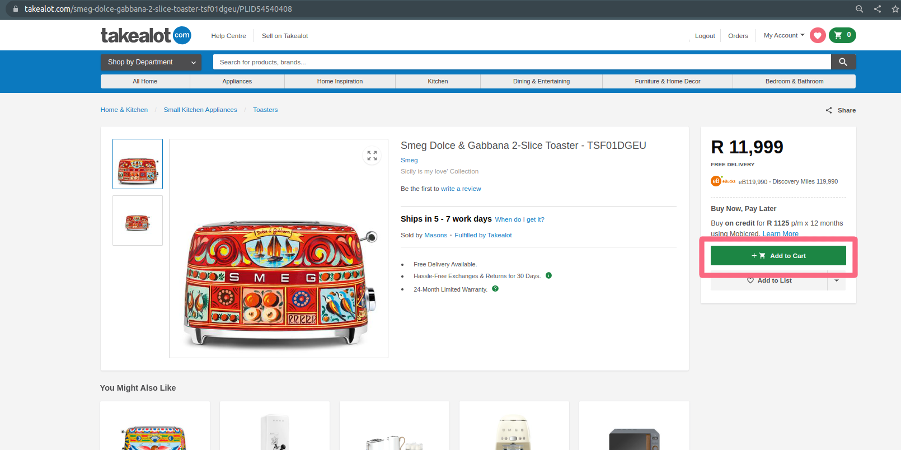
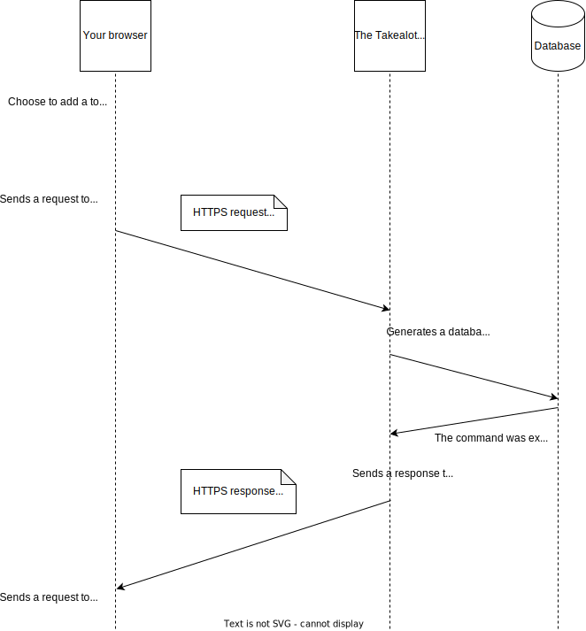

In the last part of this series, you loaded more toasters to learn about AJAX, pagination and DOM manipulation. 

## The story continues

Let's say you have been searching for a while and you now see a toaster you want to purchase. You click on the toaster and get redirected to a new page that shows the details of the toaster.

So your browser requested some information from the server in the usual way, and then rendered the toaster's details page. If you have really expensive taste in toasters, then the page might end up looking something like this:

Next up you click on the Add To Card button. 

Now a lot of fancy stuff happens.

1. The button turns into a spinner
2. Then it stops spinning
3. A message pops up telling you that the toaster is in your shopping card
4. The green shopping card widget at the top right of the screen gets updated to show the number of items in your cart

You can now navigate to your shopping cart and see the toaster is there. You can edit the contents of your cart (eg remove the toaster, or decide you want 2 toasters), and you can choose to "Checkout" (meaning, pay for the contents of your shopping cart).

## HTTP requests aren't just for fetching information 

When you chose to add the toaster to your shopping cart then an HTTPS request got sent to the server. 

So far in this story you have only seen the browser send requests when it wants information - we have requested HTML and CSS files, and we have requested pages of information about toasters.

In this case we are not fetching any new information. We're sending the server some information. The server now needs to remember that information.

The server will then communicate with the database in order to insert some new information. It'll remember what is in your shopping cart. 

The server will still respond to the request, but the response will be small. It will say something like "OK".

Now, if you close your web browser and then open it up again and navigate back to your shopping cart page, you'll see the toaster is still there.

## Privacy

You wont be able to see what is inside other people's shopping carts. And you wont be able to add anything to other people's shopping carts. You only have access to your own.

This means that the Takealot server needs to be able to figure our who different HTTP requests are coming from and what those people are allowed to do. 

Now, it's important to know that **clients should not be trusted**... 

HTTPS requests are sent from clients to servers when new pages are loaded and when a JavaScript function decides to send the request. Anybody who can write Javascript can write code that sends requests from a browser. And they can put whatever they want into those requests.They can pretend to be someone they are not. 

So a malicious person could write some code that sends some HTTPS requests to Takealot's servers to see what is inside other people's shopping baskets. Takealot's servers need to be clever enough to figure out which requests are allowed and which are not.

## Auth

When Takealot's server receives an HTTPS request then it needs to do the following: 

1. It needs to figure out who the HTTPS request came from. This is called Authentication
2. It needs to check if the person who sent the request is allowed to do whatever they are trying to do. This is called Authorization
3. It then needs to respond appropriately 

### Authentication 

The basic idea is that when Takealot's server sends an HTTPS response to a client, it can include a super-secret password as a part of the response. The password would look like a really long and crazy combination of letters and characters and it would be close to impossible to guess.

That crazy password then gets saved in the browser. The browser then includes that password in any requests it sends to Takealot's servers.

It's important to note that this password is very different to what you are used to. It's something you would never really see or need to remember. It's generated by Takealot's server when it is needed. These passwords are generally referred to as "tokens" or "cookies" or both.

So if you open up Takealot's website, your browser will check if it has a token/cookie already. If it does then it'll attach that value to all HTTP(S) requests sent to the Takealot server so that the server knows which browser is making the request.

At some point you are likely to log in. You'll either log in before you start searching for products, or before you pay for what is in your cart.

When you log in then you send an HTTPS request to the server that includes your email address and a password that you chose. The server will generally create a new cookie/token for you immediately and consolidate what it knows about you. 

### Authorization

Let's say you have logged in. 

If you try to search for a kettle to go with your toaster then your browser will send your token/cookie to Takealot when the search results are requested. 

Takealot will then be able to save some information in the database so it remembers that you are interested in kettles. 

Since the kettle search results are public, it'll just show you the results.

If you add a kettle to your shopping cart then Takealot will check whose shopping cart you are trying to add it to. If it is your own cart then it'll let you do that. 

## Security is HARD

This is really just the tip of the iceberg when it comes to security. We will go more in depth a little later.

Let's just take a moment to think about all the things that can go wrong in the scenario we have outlined so far.

1. Someone malicious could get access to your computer and act on your behalf. They can look at what you have bought and they can try to buy things without your permission. 
2. If someone gets hold of your cookie/token then they can generate HTTP(S) requests that look like they come from you
3. HTTPS is a secure version of HTTP, but if your computer is on a network that is controlled by someone malicious then they could perform what is called a man-in-the-middle attack and read and alter the requests you send to the Takealot servers
4. If someone gets hold of your email address and password (your normal login credentials) then they can generate new cookies/tokens whenever they want to 

And there's more. 

Online retailers such as Takealot have the responsibility to keep things secure and hire teams of security professionals to keep things safe. 

This section isn't meant to scare you! It's just important for you to know that security is important, and it's not easy. It's also the responsibility of the end-user. If you choose an easy-to-guess password and your privacy is compromised then that's your fault and nobody else's.

