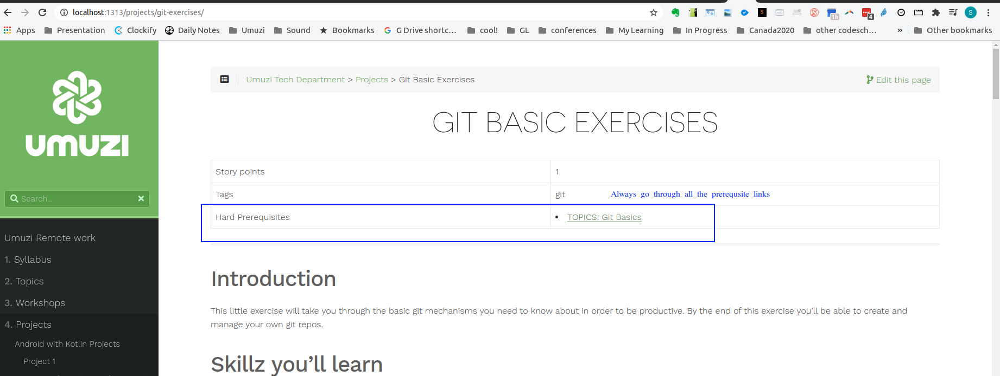

We want to help you to be successful here. There are a few things that you NEED to get right or you wont make it through our bootcamp.

## Dont copy code!

We expect you to WRITE YOUR OWN CODE! Seriously. If we catch you copy-pasting then we wont be able to accept you!

Why?

A real coder aims to understand stuff. And if you want to be a professional coder and all you know how to do is copy-paste other people's hard work you wont make it as a professional.

## Help each other

If someone gets stuck, help them to understand. Don't just give them code to copy.

## Follow instructions carefully and completely

- If we ask you to fill in a form: Do it carefully and correctly
- If we give you a project to do: Do the whole thing, and make sure you follow the instructions. For example if we say "write a function that returns 5" and instead you print "five" to the screen we wont be very impressed

## Finish your pre-bootcamp work BEFORE you get to bootcamp

There are a couple of projects we've given to you. You need to get that stuff done before you get to bootcamp or you're going to have a very hard time at bootcamp.

## If we give you something to read then read it

There are important details in the things we send you. You need to focus.

You also need to go through any listed pre-requisites. You'll often see those at the top of a content page. Like this:

## DONT COPY CODE!!!!

Yes, I'm repeating myself. If we catch people copying then those people have lost their oppertunity. It's always sad when we have to tell people to leave. Please take this very seriously.