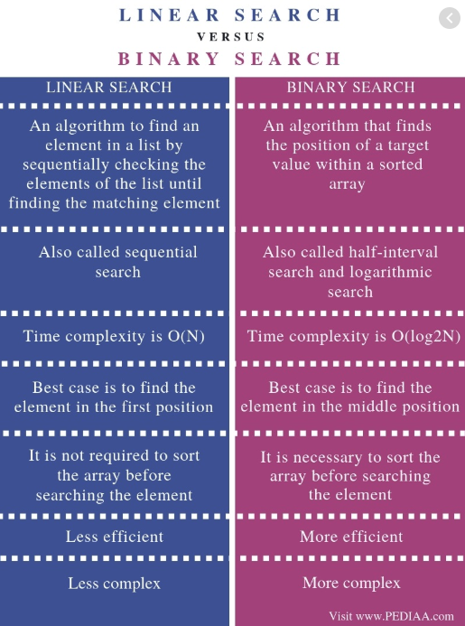
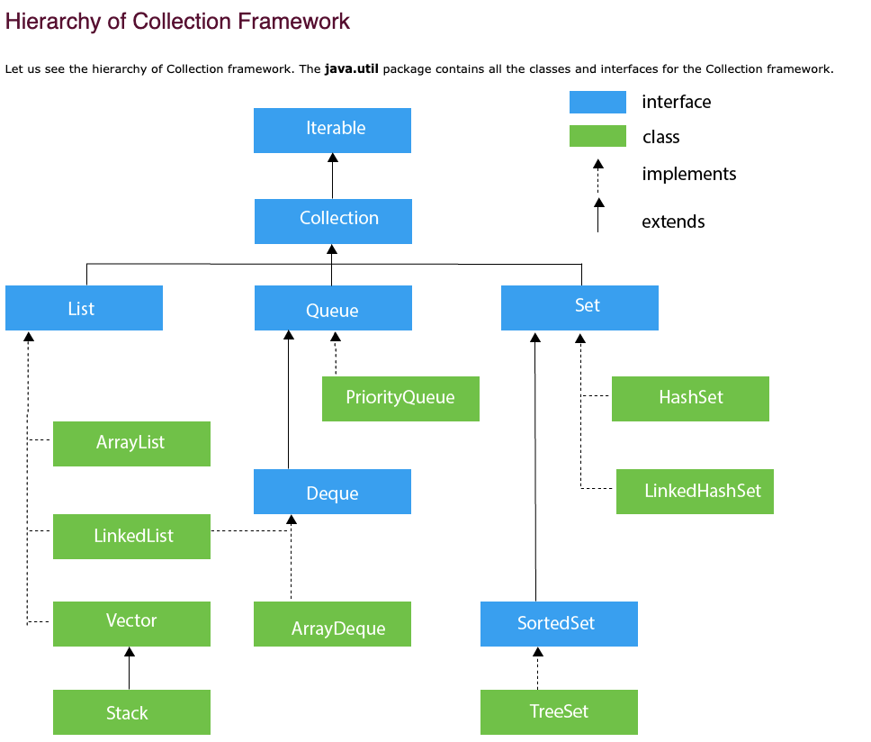

Till now I am sure you have heard that the computer has storage either RAM or disk, which it uses to store information we care about. As people we care about a lot of things meaning a lot of information being stored  and efficiently enough for us to get access to it without any hassles.

Computers use this efficient storing of data to allow us to get information quickly with the help of data structures

Take for example the differences between a binary tree and array

## Collections

A Collection is a group of individual objects represented as a single unit. Java provides Collection Framework which defines several classes and interfaces to represent a group of objects as a single unit.

The Collection interface (java.util.Collection) and Map interface (java.util.Map) are the two main “root” interfaces of Java collection classes.

## Resource

https://opensourceforu.com/2015/06/data-structures-made-easy-with-java-collections/

https://www.geeksforgeeks.org/data-structures/

https://www.geeksforgeeks.org/linked-list-vs-array/

https://www.geeksforgeeks.org/collections-in-java-2/