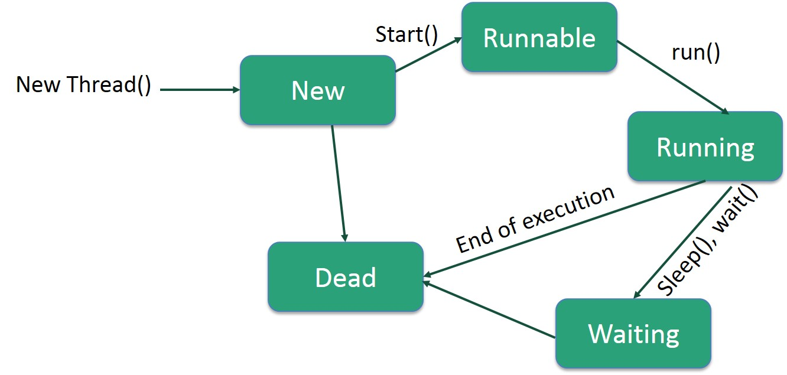
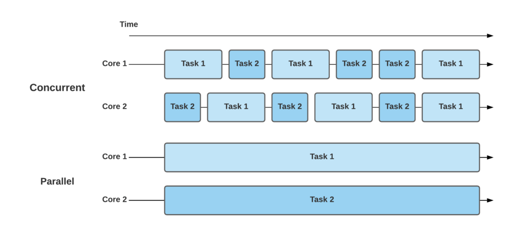

By now, you should have heard about java being multi-threaded - but what does that mean exactly?

Unlike JavaScript for example - which is a single threaded language; Java has multiple threads to help you run your program faster. 

## What is Multithreading

Multithreading means that you have multiple threads of execution inside the same application. A thread is like a separate CPU executing your application. Thus, a multithreaded application is like an application that has multiple CPUs executing different parts of the code at the same time. 

***A thread goes through a life-cycle which can be seen in the diagram below***



### how to create a thread

```
// Thread definition used here where Runnable is a functional interface
Thread(Runnable r)

// so to create a new thread you would do it like this
class Test {
    public static void main(String args[]) {
        // lambda expression to create the object
        new Thread(() -> {
            System.out.println("New thread created");
        }).start();
    }
}

```

## What is Concurrency

Concurrency actually means that multiple tasks can be executed in an overlapping time period. One of the tasks can begin before the preceding one is completed; however, they won’t be running at the same time. The CPU will adjust time slices per task and appropriately switch contexts. That’s why this concept is quite complicated to implement and especially debug.

There are many components/utilities in the concurrency package, one of the commonly used one is ***Executor***

**Executor:** is a set of interfaces that represents an object whose implementation executes tasks. It depends on the implementation whether the task should be run on a new thread or on a current thread. This means, we can decouple the task execution flow from the actual task execution mechanism using this interface.

```
public interface Executor {
    void execute( Runnable command );
}
```

In order to create an executer instance, we need to create an invoker:

```
public class Invoker implements Executor {
   @Override
   public void execute(Runnable r) {
       r.run();
   }
}
```

Now, for the execution of the task, we can use this invoker:

```
public void execute() {
   Executor exe = new Invoker();
   exe.execute( () -> {
       // task to be performed
   });
}

```

## What is Parallelism

Parallelism is the ability to execute independent tasks of a program in the same instant of time. Contrary to concurrent tasks, these tasks can run simultaneously on another processor core, another processor, or an entirely different computer that can be a distributed system. As the demand for computing speed from real-world applications increases, parallelism becomes more common and affordable.



#### Extra Resources

- https://www.baeldung.com/cs/concurrency-vs-parallelism
- https://www.geeksforgeeks.org/java-util-concurrent-package/
- https://www.geeksforgeeks.org/java-util-concurrent-package/
- https://www.tutorialspoint.com/java_concurrency/concurrency_overview.htm
- https://www.tutorialspoint.com/java_concurrency/concurrency_major_operations.htm
- https://www.tutorialspoint.com/java_concurrency/concurrency_deadlock.htm
- https://deadlockempire.github.io/#menu - this one is fun
