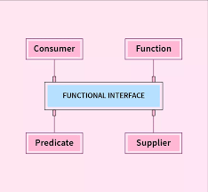

## Lambda expressions

Lambda expressions, introduced in Java 8, are concise and anonymous blocks of code that can take parameters and return values, similar to methods.

## Functional Interface

Functional Interfaces are called Single Abstract Method (SAM) interfaces. They can have many default and static methods but only one abstract method - this is why they are called SAM. They make it possible to create abstractions that multiple classes can use without copying and pasting code. This is especially helpful when developers need to create a complex abstraction with various methods and behaviors.

By combining functional interfaces with lambda expressions, we can achieve smaller and cleaner code, eliminating the need for excessive boilerplate code.

### Functional interfaces have four types



Read more about them [here](https://www.geeksforgeeks.org/functional-interfaces-java/#:~:text=Java%20SE%208%20included%20four%20main%20kinds%20of%20functional%20interfaces%20which%20can%20be%20applied%20in)

### Example of built-in functional interface

```
// Create an anonymous inner-class object and start its execution
new Thread(new Runnable() {
    @Override public void run() {
        System.out.println("New thread created");
    }
}).start();
```

We can use lambda expressions to re-write the code above, like so:

```
// lambda expression to create a Runnable object and start its execution
new Thread(() -> {
    System.out.println("New thread created");
}).start();
```

### Custom functional interface

```
@FunctionalInterface  
  interface Dog{  
      void sound(String message);  
  }

  public class DogImplementation implements Dog{  
      public void sound(String message){  
          System.out.println("Dog " + message);  
      }  
      public static void main(String[] args) {  
          DogImplementation obj = new DogImplementation();  
          obj.sound("Bark!");
      }  
  }
```

## Extra Recourses

- https://www.geeksforgeeks.org/functional-interfaces-java/
- https://www.javatpoint.com/java-8-functional-interfaces
- https://www.baeldung.com/java-8-functional-interfaces