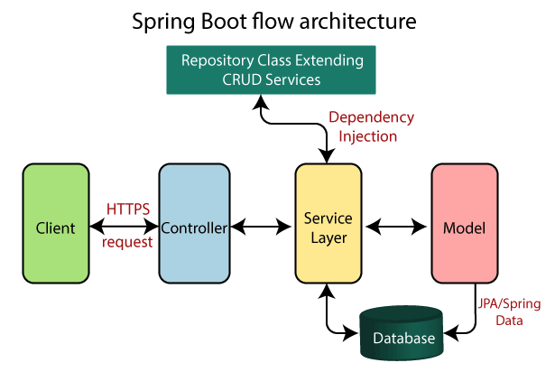

Spring Boot is a very big and complex framework and for the next few weeks we are going to spend a great deal of time focusing on the core of the framework and all its parts. There will be a lot of content to go through so please go through it diligently as it will set a solid foundation for you.

## The Difference Between Spring and Spring boot

**Spring**

Spring is one of the most extensively used Java EE Frameworks for building applications. For the Java platform, the Spring framework provides a detailed programming and configuration model. It aims to simplify the Java EE development and helps developers be more productive at work. It can be used at any kind of deployment platform. It tries to cater for todays needs in business to make it quick an easy to develop applications.

**Spring Boot**

While the Spring framework focuses on providing flexibility to you, Spring Boot aims to shorten the code length and provide you with the easiest way to develop a web application. With annotation configuration and default codes, Spring Boot shortens the time involved in developing an application. It helps create a stand-alone application with less or almost zero-configuration. IT is a module of the spring framework and built on top of it.


Spring Boot follows a layered architecture in which each layer communicates with the layer directly below or above it (hierarchical structure).

**Presentation Layer:** The presentation layer handles the HTTP requests (your Restful api), translates the JSON parameter to object, and authenticates the request and transfer it to the business layer. In short, it consists of views i.e., frontend part.

**Business Layer:** The business layer handles all the business logic. It consists of service classes and uses services provided by data access layers. It also performs authorization and validation.

**Persistence Layer:** The persistence layer contains all the storage logic and translates business objects from and to database rows using different tools such JDBC and Repository.

**Database Layer:** In the database layer, CRUD (create, retrieve, update, delete) operations are performed. The actual scripts which get/insert information to and from the database

Spring boot flow architecture looks like this




## Spring Boot Annotation

Spring Boot is easier to work with because it auto configures objects and resources for us using annotation, and annotations are big on Spring so its probably a good idea to look over some of the core annotations to get an application started.

**@Autowired**
We can use the @Autowired to mark a dependency which Spring is going to resolve and inject. We can use this annotation with a constructor, setter, or field injection.

[Checkout Spring Core Annotations Here](https://www.baeldung.com/spring-core-annotations)

**@SpringBootApplication**
We use this annotation to mark the main class of a Spring Boot application, it encapsulates @Configuration, @EnableAutoConfiguration, and @ComponentScan annotations with their default attributes.

[Checkout Spring Boot Annotations Here](https://www.baeldung.com/spring-boot-annotations)


**and many others**


## Dependency Injection

Before we can understand dependencies inject we have to first understand what inversion of control(Ioc) is and why we care about it

## What Is Inversion of Control?

Inversion of Control is a principle in software engineering by which the control of objects or portions of a program is transferred to a container or framework. It's most often used in the context of object-oriented programming.

By contrast with traditional programming, in which our custom code makes calls to a library, IoC enables a framework to take control of the flow of a program and make calls to our custom code.

**The advantages of this architecture are:**

- decoupling the execution of a task from its implementation
- making it easier to switch between different implementations
- greater modularity of a program
- greater ease in testing a program by isolating a component or mocking its dependencies and allowing components to communicate through contracts

## What Is Dependency Injection?

Dependency injection is a pattern through which to implement IoC, where the control being inverted is the setting of object's dependencies. The act of connecting objects with other objects, or “injecting” objects into other objects, is done by an assembler rather than by the objects themselves

Simply put, this allows for loose coupling of components and moves the responsibility of managing components onto the container.

**There are 3 overall types of injection**

1. Constructor Injection

```
Class Animal {
    
        @Autowired
        public Dog dog() {
            return new Dog();
        }

}
```

2. Setter Injection

```
Class Animal {
        private Dog dog;

        @Autowired
        public void setDog(Dog dog) {
            this.dog = dog;
        }
}
```

3. Field Injection

```
Class Animal {
        @Autowired
        private Dog dog;
}
```

**Interface - (Not officially a type)**

```
Class RestController {
        @Autowired // still field injection but this is how you can create an abstraction between your view and service
        private AccountService accService;
}

Interface AccountService {
        ...
}

Class AccountServiceImpl implements AccountService {
        ...
}
```

## Spring Actuator
This feature provides a lot of insights of a running Spring boot application. For example, you can use Actuator to find out which beans are created in Spring's application context and which request path are mapped to controllers.


## Resources
https://dzone.com/articles/understanding-the-basics-of-spring-vs-spring-boot

https://www.javatpoint.com/spring-boot-architecture

https://www.javatpoint.com/spring-vs-spring-boot-vs-spring-mvc

https://www.javatpoint.com/spring-boot-dm

https://www.baeldung.com/spring-dependency-injection

https://www.baeldung.com/inversion-control-and-dependency-injection-in-spring

https://www.baeldung.com/spring-core-annotations

https://www.baeldung.com/spring-boot-annotations

https://www.tutorialspoint.com/spring_boot/index.htm