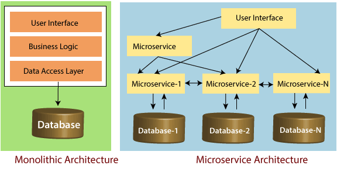

## Microservices

In 2005 Dr Peter Rogers introduced the term micro-web-service introducing the concept of loose-coupled services interacting with one another. It wasn't until 2011 where people who were exploring this architecture starting sharing their ideas and thought and thus increasing the spread and popularity.

#### So what is Microservice Architecture

From Wikipedia

```
a variant of the service-oriented architecture (SOA) structural style— that arranges an application as a collection of loosely coupled services. In a microservices architecture, services are fine-grained and the protocols are lightweight
```

In simple terms according to **Sam Newman** "Microservices are the small services that work together"

**But there are fundamental rules that need to be noted about these service which are:**

1. **Single Responsibility principle:** focuses on a piece of functional and only that functionality

2. **High Cohesion Combined With Loose Coupling:** able to change and deploy without affecting other services

3. **Presenting an API:** REST is common but modern transport mechanism are also valid

4. **Unique Source of Identification:** There need to be an id(e.g ApplicationID) which uniquely identifies a record of information

5. **Data Storage Segregation:** Access to data should be owned by the service

6. **Traffic Management:** Make sure service can communicate when its overloaded and can terminate calls that take long to respond

7. **Automating The Process:** Self-deploy service without any intervention (CI/CD)

8. **Minimal Database Tables** (Preferably Isolated Tables)

9. **Constant Monitoring**



Two of the most commonly used Api architectures currently in use are REST and SOAP.

## What is REST (Representational State Transfer)?

REST is an architecture used in web applications that make it easier for different systems to communicate with each other.
They are referred to as stateless, which means that the current state of the system calling the REST api, has no influence on the functionality
of the Api. REST was created to fix some of the shortcomings that the SOAP architecture has.

The most common REST endpoints are the following:

GET - Used to fetch data
POST - Used to create a new resource
PUT - Used to update a specific resource
DELETE - Used to remove a specific resource

## What is SOAP (Simple Object Access Protocol) ?

SOAP is an architecture that makes use of XML for queries. It was created before REST to replace systems at that time that made use of
binary messaging.

## We'll focus on REST in the context of this document.

## Here is a list of resources where you can find tutorials on the endpoint types.

As part of the examples, let's assume the url to be `https://www.myapi.com`

## GetMapping

- [GET Endpoint](http://zetcode.com/spring/getmapping/).

```
  @GetMapping("/employees")
  List<Users> all(String item) {
	return listOfUsers;
  }
```

Here is a breakdown of the snippet above:

- @GetMapping: Tells the API that this method is a Get Endpoint.
- "/employees": Describes what is appended to the url in order to reach the endpoint. This endpoint is reached using the following url: https://www.myapi.com/employees.
- The endpoint returns a List of Users.
- item: The variable being passed into the method.

## PostMapping

- [POST Endpoint](https://howtodoinjava.com/spring5/webmvc/controller-getmapping-postmapping/).

```
@PostMapping(value = "/posts")
public UserRest createUser(@RequestBody UserDetailsRequestModel requestUserDetails)
{
	UserRest returnValue = new UserRest();

	UserDto userDto = new UserDto();
	BeanUtils.copyProperties(requestUserDetails, userDto);
	UserDto createdUser = userService.createUser(userDto);
	BeanUtils.copyProperties(createdUser, returnValue);
	return returnValue;
```

Here is a breakdown of the snippet above:

- @PostMapping: Tells the API that this method is a POST Endpoint.
- "/posts": Describes what is appended to the url in order to reach the endpoint. This endpoint is reached using the following url: https://www.myapi.com/posts.
- The endpoint returns a List of Users.
- @RequestBody: The data model that was sent through the POST request. The requestbody is usually sent to the endpoint in a JSON string format.

## PutMapping

- [PUT Endpoint](https://www.sourcecodeexamples.net/2019/10/putmapping-spring-boot-example.html).

```
@PutMapping(value = "/contacts/{contactId}")
public ResponseEntity<Contact> updateContact(@RequestBody Contact contact,
		@PathVariable long contactId) {
	...
	return ...
}
```

Here is a breakdown of the snippet above:

- @PutMapping: Tells the API that this method is a PUT Endpoint.
- "/contacts/{contactId}": Describes what is appended to the url in order to reach the endpoint. This endpoint is reached using the following url: https://www.myapi.com/posts/1234-1234-23432.
- {} indicates that something in the path is a variable. So it's not a fied value.
- The endpoint returns a List of Users.
- @RequestBody: The data model that was sent through the POST request. The requestbody is usually sent to the endpoint in a JSON string format.

## PatchMapping

- [PATCH Endpoint](https://www.sourcecodeexamples.net/2019/10/patchmapping-spring-boot-example.html).

```
@PatchMapping("/patch")
public @ResponseBody ResponseEntity<String> patch() {
	return new ResponseEntity<String>("PATCH Response", HttpStatus.OK);
}
```

Here is a breakdown of the snippet above:

- @PatchMapping: Tells the API that this method is a PATCH Endpoint.
- "/patch": Describes what is appended to the url in order to reach the endpoint. This endpoint is reached using the following url: https://www.myapi.com/patch.

## DeleteMapping

- [DELETE Endpoint](http://zetcode.com/spring/deletemapping/).

```
@DeleteMapping(value = "/posts/{id}")
public ResponseEntity<Long> deletePost(@PathVariable Long id) {

	var isRemoved = postService.delete(id);

	return new ResponseEntity<>(id, HttpStatus.OK);
}
```

Here is a breakdown of the snippet above:

- @DeleteMapping: Tells the API that this method is a DELETE Endpoint.
- "/contacts/{contactId}": Describes what is appended to the url in order to reach the endpoint. This endpoint is reached using the following url: https://www.myapi.com/posts/1234-1234-23432.
- {} indicates that something in the path is a variable. So it's not a fied value.

## How can a developer test endpoints

Using programs such as Postman, a developer can easily insert the details of the endpoint required and view the results the api returns.
It is a widely used software in the development community.

## Resources

https://dzone.com/articles/9-fundamentals-to-a-successful-microservice-design
https://techbeacon.com/app-dev-testing/5-fundamentals-successful-microservice-design
https://www.javatpoint.com/advantges-and-disadvantages-of-microservices
https://www.javatpoint.com/challenges-of-microservices-architecture
https://www.marcobehler.com/guides/java-microservices-a-practical-guide
https://www.guru99.com/soap-simple-object-access-protocol.html.
https://www.sitepoint.com/developers-rest-api/
https://spring.io/guides/tutorials/bookmarks/
https://www.youtube.com/watch?v=_Py89z5Reus
http://www.appsdeveloperblog.com/postmapping-requestbody-spring-mvc/
http://zetcode.com/spring/postmapping/
http://www.appsdeveloperblog.com/putmapping-spring-mvc/
https://www.programcreek.com/java-api-examples/index.php?api=org.springframework.web.bind.annotation.PutMapping
https://www.javaguides.net/2018/11/spring-getmapping-postmapping-putmapping-deletemapping-patchmapping.html
https://www.javaguides.net/2018/09/spring-boot-2-hibernate-5-mysql-crud-rest-api-tutorial.html
http://zetcode.com/spring/deletemapping/
https://www.concretepage.com/spring-boot/spring-boot-rest-example
https://www.postman.com/