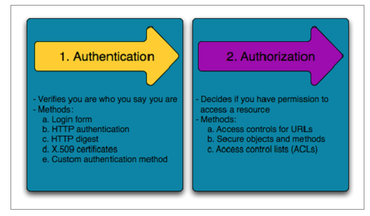

## Spring Boot Security

Now that we are going to create applications which can be accessed by the outside world, security becomes important because you don't want people having access to information which they are not allowed to have.

Spring Security has an architecture that is designed to separate authentication from authorization, and has strategies and extension points for both.

Spring Security is a framework that provides authentication, authorization, and protection against common attacks. With first class support for both imperative and reactive applications, it is the de-facto standard for securing Spring-based applications.

#### Difference Between Authorization and Authentication



#### Features

- Comprehensive and extensible support for both Authentication and Authorization

- Protection against attacks like session fixation, clickjacking, cross site request forgery, etc

- Servlet API integration

- Optional integration with Spring Web MVC

you will need

```
dependencies {
    compile "org.springframework.boot:spring-boot-starter-security"
}


@Configuration
@EnableWebSecurity
public class WebSecurityConfig extends WebSecurityConfigurerAdapter {
    //override configuration

    // override userDetailsService
}
```

With this dependencies you get a lot out of the box and it also provides basic security with little configuration. You can override some of these behaviors by using WebSecurityConfigurerAdapter

## Spring Boot Caching

We live in a word where data is not so cheat and access to wifi is currently not accessible to everyone. More so we don't have as many people using smart devices which makes using advanced technology a bit of a struggle. It is our responsibility as software developers to know these limitation so we can create software that is thoughtful. Meaning creating applications that don't require a lot of processing power, high speed and if possible even be able to work offline. Caching is the first, no-brainer step you can take

#### What is Caching

Caching is a mechanism to enhance the performance of a system. It is a temporary memory that lies between the application and the persistent database. Cache memory stores recently used data items in order to reduce the number of database hits as much as possible. [from](wtodoinjava.com/spring-boot2/spring-boot-cache-example/)

#### Types of caching

1. **In-memory caching:** Most frequently used cached, stored in RAM(Random Access Memory) and thus fast to access

2. **Database caching:** Databases have cache by default and this can be manipulated to show significant results

3. **Web server caching:** Caching request and responses to server at API level with the help of Reverse proxies

4. **CDN(Content Delivery Network) caching:** a CDN will reduce the load on an application origin and improve the experience of the requestor by delivering a local copy of the content from a nearby cache edge, or Point of Presence (PoP).

#### Spring boot Caching Annotation

**@EnableCaching:** It enables Spring’s annotation-driven cache management capability.

**@Cacheable:** It is used on the method level to let spring know that the response of the method are cacheable

**@CacheEvict:** It is used when we need to evict (remove) the cache previously loaded of master data

```
org.springframework.boot:spring-boot-starter-cache

@Service
public class StudentService
{
    @Cacheable("student")
    public Student getStudentByID(String id)
    {
        try
        {
            System.out.println("Going to sleep for 5 Secs.. to simulate backend call.");
            Thread.sleep(1000*5);
        }
        catch (InterruptedException e)
        {
            e.printStackTrace();
        }

        return new Student(id,"Sajal" ,"V");
    }
}
```

## Resource

https://spring.io/guides/topicals/spring-security-architecture

http://www.differencebetween.net/technology/difference-between-authentication-and-authorization/#:~:text=Authentication%20confirms%20your%20identity%20to,access%20is%20allowed%20or%20not.

https://dzone.com/articles/secure-a-spring-boot-app-with-spring-security-and

https://www.baeldung.com/spring-security-multiple-auth-providers

https://docs.spring.io/spring-security/site/docs/5.3.1.BUILD-SNAPSHOT/reference/html5/

https://www.javainuse.com/spring/sprboot_sec

https://howtodoinjava.com/spring-boot2/spring-boot-cache-example/ - **Go through this tutorial**

https://dzone.com/articles/introducing-amp-assimilating-caching-quick-read-fo

https://aws.amazon.com/caching/cdn/