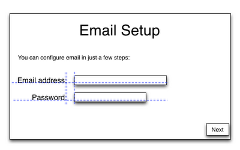
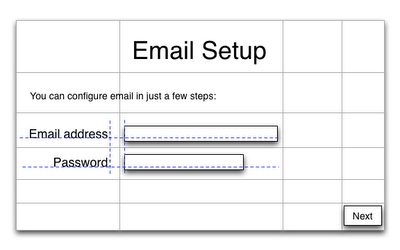
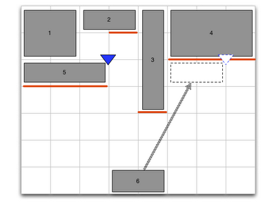

Ice Cream Sandwich (ICS) sports two new widgets that have been designed to support the richer user interfaces made possible by larger displays: Space and GridLayout.

The most commonly used class for layout in Android is LinearLayout, which allows its children to be aligned in the usual ways: along either the horizontal or vertical axes. It’s often possible to take a complicated layout and break it down into a set of nested linear layouts and, provided this nesting doesn’t get too deep, this is still a good choice for many simple layouts.

A number of posts and articles (e.g. Android Layout Tricks #1, Flattening The Stack) have highlighted drawbacks of nested layouts; which fall into three basic categories:

- Inability to control alignment along both axes simultaneously

- Performance problems in hierarchies that are too deep

- Unsuitability for design tools that support free-form editing

A simple example of the first problem is the following form:



As the font and the text of the “Email address” label change, we want the label to remain aligned with the baseline of the component to its right, and aligned with the right edge of the label below it. It’s not possible to do this with nested LinearLayouts because the label needs to be aligned with other components both horizontally and vertically.

These problems aren’t new to Android, or UI toolkits in general, but we’ve used them to drive our work in enriching platform support for flatter hierarchies.

### GridLayout
To provide better support for layouts like these we have added a new layout to the Android framework: GridLayout, which can be used to solve the above problems by dividing the container’s real estate into rows and columns:



Now the “Email address” label can belong both to a row that is baseline-aligned, and a column that is right-aligned.

GridLayout uses a grid of infinitely-thin lines to separate its drawing area into: rows, columns, and cells. It supports both row and column spanning, which together allow a widget to occupy a rectangular range of cells that are next to each other. We’ll use the words row, column, and cell in the text below as shorthand for row group, column group and cell group respectively, where groups have one or more contiguous elements.

#### Similarities with LinearLayout
Wherever possible, GridLayout uses the same conventions as LinearLayout for all its XML API — so it should be easy to start using GridLayout if you’ve already used LinearLayout. In fact, the APIs are so similar that changing a tag name from LinearLayout to GridLayout in an XML file that uses LinearLayout will often produce a similar UI without requiring any other changes. When it doesn’t, you’ll still generally end up with a good starting point for a two-dimensional layout.

### Getting Started
Two examples in the samples area of the Android 4.0 SDK show typical use of the programmatic and XML APIs respectively:

- https://samples/ApiDemos/src/com/example/android/apis/view/GridLayout0.java

- https://samples/ApiDemos/res/layout/grid_layout_1.xml

[Both examples produce the same UI.]

Here’s a slightly simpler version of the above XML layout.
```
<?xml version="1.0" encoding="utf-8"?>
<GridLayout
        xmlns:android="http://schemas.android.com/apk/res/android"

        android:layout_width="match_parent"
        android:layout_height="match_parent"

        android:useDefaultMargins="true"
        android:alignmentMode="alignBounds"
        android:columnOrderPreserved="false"

        android:columnCount="4"
        >

    <TextView
            android:text="Email setup"
            android:textSize="32dip"

            android:layout_columnSpan="4"
            android:layout_gravity="center_horizontal"
            />

    <TextView
            android:text="You can configure email in just a few steps:"
            android:textSize="16dip"

            android:layout_columnSpan="4"
            android:layout_gravity="left"
            />

    <TextView
            android:text="Email address:"

            android:layout_gravity="right"
            />

    <EditText
            android:ems="10"
            />

    <TextView
            android:text="Password:"

            android:layout_column="0"
            android:layout_gravity="right"
            />

    <EditText
            android:ems="8"
            />

    <Space
            android:layout_row="4"
            android:layout_column="0"
            android:layout_columnSpan="3"
            android:layout_gravity="fill"
            />

    <Button
            android:text="Next"

            android:layout_row="5"
            android:layout_column="3"
            />
</GridLayout>
```
The first difference you’ll notice in these examples is the absence of the WRAP_CONTENT and MATCH_PARENT constants that normally adorn Android layout resources. You don’t normally need to use these with GridLayout, for reasons that are described in the API doc for __GridLayout.LayoutParams__.

### Row and Column Indices
The second thing you may notice in the XML resources is that widgets don’t always explicitly define which cells they are to be placed in. Each widget’s layout parameters have row and column indices that together define where the widget should be placed but when either or both of these values are not specified, GridLayout supplies default values rather than throwing an exception.

### Automatic Index Allocation
As children are added to a GridLayout, it maintains a cursor position and a “high-water mark” that it uses to place widgets in cells that don’t yet have anything in them.



When GridLayout’s orientation property is horizontal and a columnCount has been set (to 8 in this example) the high-water mark (shown above in red) is maintained as a separate height value for each column. When indices need to be created, GridLayout first determines the size of the cell group (by looking at the rowSpan and columnSpan parameters of the new widget) and then, starting at the cursor, goes through the available locations from: left to right, top to bottom, so as to find the row and column indices of the first location that’s free.

When GridLayout’s orientation is vertical, all of the same principles apply, except that the roles of the horizontal and vertical axes are exchanged.

If you want multiple views to be placed in the same cell, you have to define the indices explicitly, as the default allocation procedure above is designed to place widgets in separate cells.

### Sizes, Margins and Alignment/Gravity
In GridLayout, specifying sizes and margins is done just as with a LinearLayout. Alignment/gravity also works just like gravity in LinearLayout and uses the same constants: left, top, right, bottom, center_horizontal, center_vertical, center, fill_horizontal, fill_vertical and fill.

### Flexibility
Unlike most grids in other toolkits, GridLayout does not associate data with rows or columns. Instead, everything to do with alignment and flexibility is associated with the components themselves. GridLayout departs from the norm here to provide a more general system that allows subtle relationships between ancestors in deeply nested layouts to be accommodated in a single layout configuration.

The flexibility of columns is inferred from the gravity of the components inside the column. If every component defines a gravity, the column is taken as flexible, otherwise the column is considered inflexible. Full details are in GridLayout’s API docs.

### Emulating Features from other Layouts
GridLayout does not incorporate all of the features of every layout in the Android platform but it has a rich enough feature set that idiomatic use of other layouts can normally be emulated from inside a single GridLayout.

Although __LinearLayout__ can be considered a special case of a GridLayout, for the degenerate case when a set of views are aligned in a single row or column, LinearLayout is the better choice when this is all that is required as it clarifies the purpose of the container and may have some (relatively small) performance advantages.

__TableLayout__ configurations are normally straightforward to accommodate, as GridLayout supports both row and column spanning. __TableRows__ can be removed, as they are not required by GridLayout. For the same UI, a GridLayout will generally be faster and take less memory than than a TableLayout.

Simple __RelativeLayout__ configurations can be written as grids simply by grouping the views that are related to each other into rows and columns. Unlike conventional grids, GridLayout uses a constraints solver to do the heavy lifting of the layout operation. By using GridLayout’s __rowOrderPreserved__ and __columnOrderPreserved__ properties it’s possible to free GridLayout from the confines of traditional grid systems and support the majority of RelativeLayout configurations — even ones that require grid lines to pass over each other as children change size.

Simple __FrameLayout__ configurations can be accommodated within the cells of a GridLayout because a single cell can contain multiple views. To switch between two views, place them both in the same cell and use the visibility constant __GONE__ to switch from one to the other from code. As with the LinearLayout case above, if all you need is the functionality described above, FrameLayout is the better choice and may have some small performance advantages.

One key feature that GridLayout lacks is the ability to distribute excess space between rows or columns in specified proportions — a feature that LinearLayout provides by supporting the principle of __weight__. This omission and possible ways around it are discussed in GridLayout’s API docs.

### The Phases of the Layout Operation
It’s useful to distinguish the allocation phase for cell indices discussed above from the layout operation itself. Normally the phase that allocates indices happens once, if at all, when a UI is initialized. The index-allocation phase only applies when indices have been left unspecified, and is responsible for ensuring that all views have a defined set of cells in which they are to be placed at layout time.

The layout operation happens after this and is recalculated each time a view changes size. GridLayout measures the size of each child during the layout operation so it can calcuate the heights and widths of the rows and columns in the grid. The layout phase completes by using gravity to place each of the components in its cell.

Although index allocation normally only happens once, GridLayout is technically a dynamic layout, meaning that if you change its orientation property or add or remove children after components have been laid out, GridLayout will repeat the above procedure to reallocate indices in a way that is right for the new configuration.

From a performance standpoint, it is worth knowing that the GridLayout implementation has been optimized for the common case, when initialization happens once and layout happens frequently. As a result, the initialization step sets up internal data structures so that the layout operation can complete quickly and without allocating memory. Put another way, changes either to GridLayout’s orientation or the number of children it has are much more expensive than an ordinary layout operation.

### Conclusion
GridLayout’s feature set incorporates much of the functionality of the Android framework’s existing general-purpose layouts: LinearLayout, FrameLayout, TableLayout and RelativeLayout. As such, it provides a way to replace many deeply nested view hierarchies with a single highly optimized layout implementation.

If you are starting a UI from scratch and are not familiar with Android layouts, use a GridLayout — it supports most of the features of the other layouts and has a simpler and more general API than either TableLayout or RelativeLayout.

We anticipate that the combination of FrameLayout, LinearLayout and GridLayout together will provide a feature set that’s rich enough to allow most layout problems to be solved without writing layout code by hand. It’s worth spending some time deciding which of these layouts is right for the top of your tree; a good choice will minimize the need for intermediate containers and result in a user interface that is faster and uses less memory.