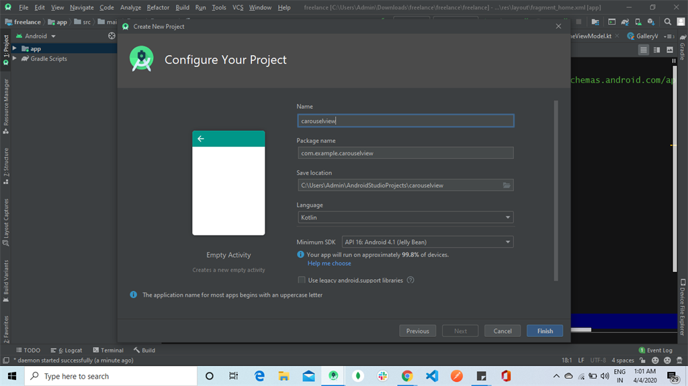
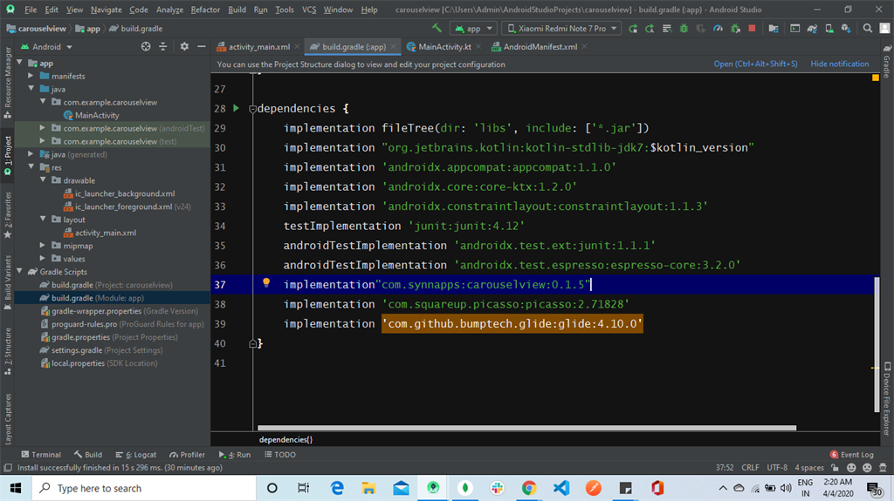
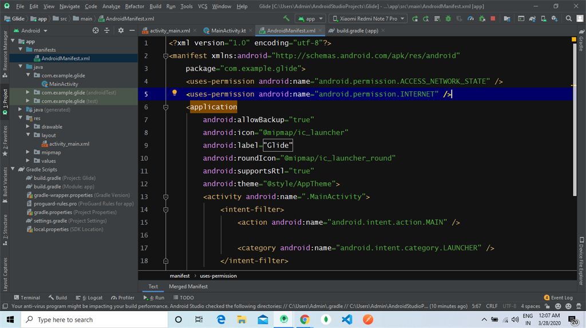
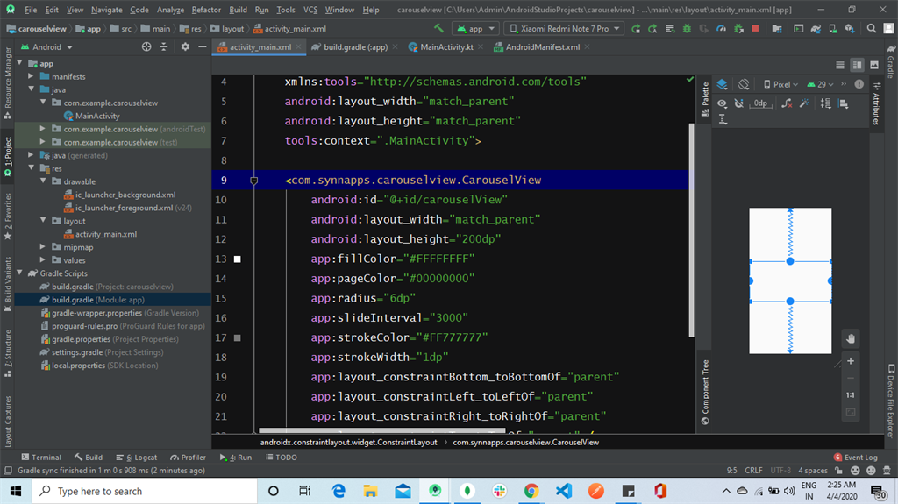
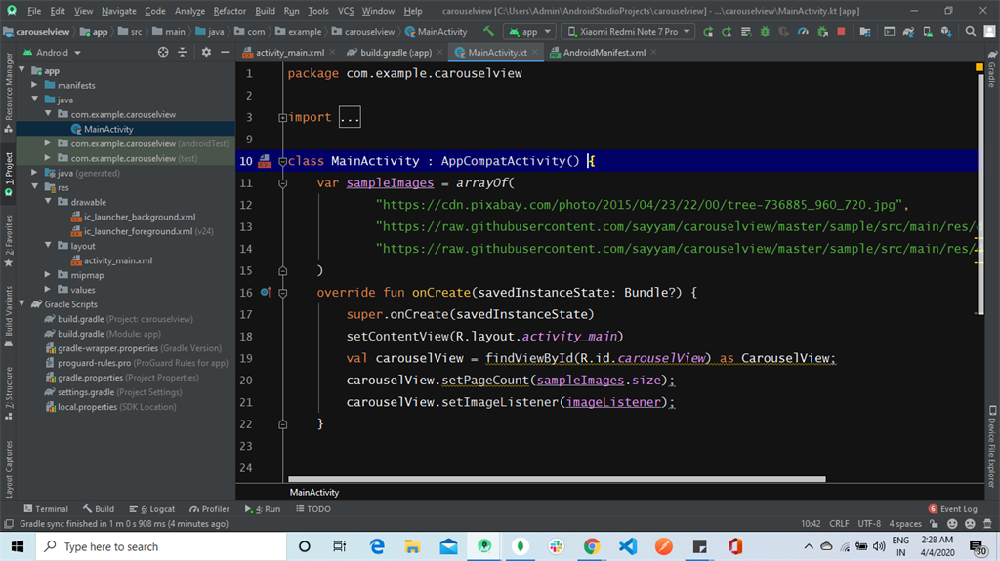
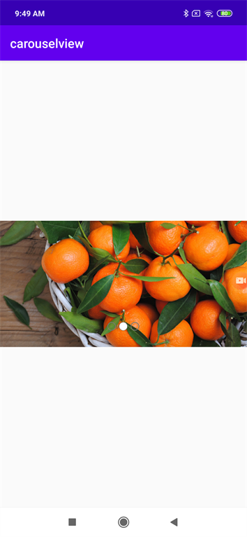
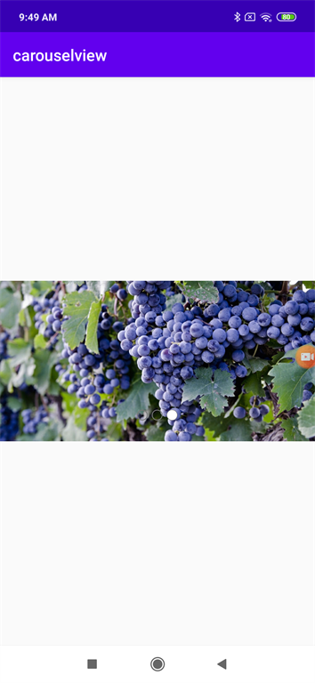

## How to Load an Image URL to Carousel View Using Picasso in Kotlin
### Introduction
 
Android is an open-source operating system based on Linux with a Java programming interface for mobile devices such as a smartphones and tablets. With over 85% market share worldwide, Android Operating System dominates the mobile platform market. Today, I will show you how to load an image URL to Carousel view, like in an e-commerce app, using Picasso In Kotlin.
 
Follow these steps to load the image URL to Imageview using Glide In Kotlin. I have included the source code in the attachment.

### Step 1
 
Open Android Studio and start a new Android Studio Project.
  
 
 
### Step 2
 
Now, add an activity and click the "Next" button.
   
 
 
### Step 3
 
You can choose your application name and choose where your project is to be stored. Choose Kotlin language for coding the project. Now, select the version of Android and select the target Android devices, then click the "Finish" button. 
 
  
 
 
 
### Step 4
 
Go to the build.grade file. Add third party dependencies for carouselview and Picasso.
 
  
 
The third party dependencies are given below:
```
implementation"com.synnapps:carouselview:0.1.5"  
implementation 'com.squareup.picasso:picasso:2.71828'  
```
Please note that package versions vary depending on the latest versions available.
### Step 5
 
Go to the manifest file and add the dependency for an internet connection.
  
 
 
 
The manifest code is given below.
```
<uses-permission android:name="android.permission.ACCESS_NETWORK_STATE"/>  
<uses-permission android:name="android.permission.INTERNET" />  
```
### Step 6
 
Go to the activity_main.xml. This XML file contains the design code for your Android app.
 
  
 
The XML code is given below.
```
<?xml version="1.0" encoding="utf-8"?>  
<androidx.constraintlayout.widget.ConstraintLayout xmlns:android="http://schemas.android.com/apk/res/android"  
   xmlns:app="http://schemas.android.com/apk/res-auto"  
   xmlns:tools="http://schemas.android.com/tools"  
   android:layout_width="match_parent"  
   android:layout_height="match_parent"  
   tools:context=".MainActivity">  
<com.synnapps.carouselview.CarouselView  
   android:id="@+id/carouselView"  
   android:layout_width="match_parent"  
   android:layout_height="200dp"  
   app:fillColor="#FFFFFFFF"  
   app:pageColor="#00000000"  
   app:radius="6dp"  
   app:slideInterval="3000"  
   app:strokeColor="#FF777777"  
   app:strokeWidth="1dp"  
   app:layout_constraintBottom_toBottomOf="parent"  
   app:layout_constraintLeft_toLeftOf="parent"  
   app:layout_constraintRight_toRightOf="parent"  
   app:layout_constraintTop_toTopOf="parent" />  
</androidx.constraintlayout.widget.ConstraintLayout>  
```
### Step 7
 
Go to Main Activity.kt. This Kotlin program is the back-end language for your app.
 
 
 
The Kotlin code is given below.
```
package com.example.carouselview  
import androidx.appcompat.app.AppCompatActivity  
import android.os.Bundle  
import android.widget.ImageView  
import com.squareup.picasso.Picasso  
import com.synnapps.carouselview.CarouselView  
import com.synnapps.carouselview.ImageListener  
class MainActivity : AppCompatActivity() {  
   var sampleImages = arrayOf(  
   "https://cdn.pixabay.com/photo/2015/04/23/22/00/tree-736885_960_720.jpg",  
   "https://raw.githubusercontent.com/sayyam/carouselview/master/sample/src/main/res/drawable/image_1.jpg",  
   "https://raw.githubusercontent.com/sayyam/carouselview/master/sample/src/main/res/drawable/image_2.jpg"  
)  
override fun onCreate(savedInstanceState: Bundle?) {  
   super.onCreate(savedInstanceState)  
   setContentView(R.layout.activity_main)  
   val carouselView = findViewById(R.id.carouselView) as CarouselView;  
   carouselView.setPageCount(sampleImages.size);  
   carouselView.setImageListener(imageListener);  
}  
var imageListener: ImageListener = object : ImageListener {  
   override fun setImageForPosition(position: Int, imageView: ImageView) {  
      // You can use Glide or Picasso here  
      Picasso.get().load(sampleImages[position]).into(imageView)  
      }  
   }  
}  
```
### Step 8
 
click the "Run" button, or press Shift+F10 to finally run the project. Choose the "virtual machine" option and click OK.
 
#### Conclusion
 
 
 
 
 
 