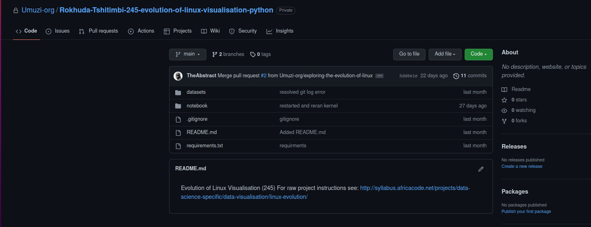
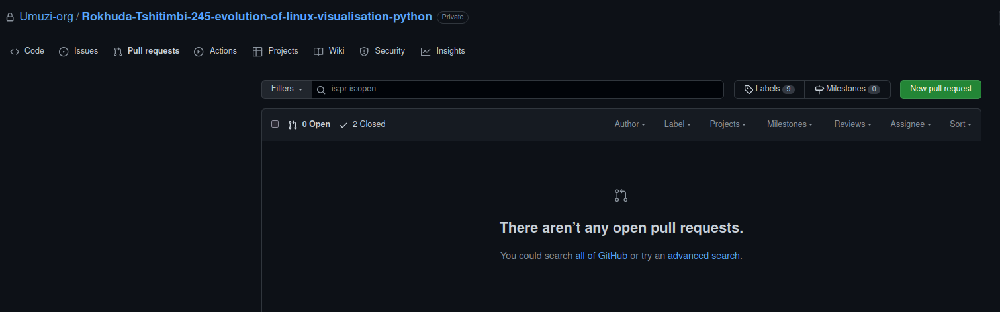
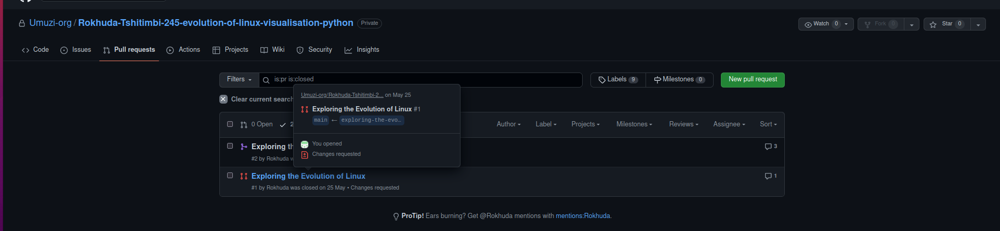
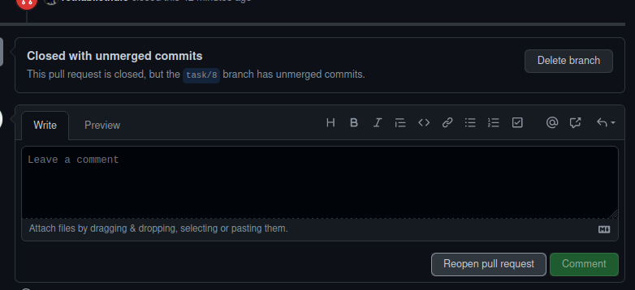

## Handling requested changes on Pull Requests

Pull requests are an excellent approach to communicating proposed code changes for review and receiving feedback from staff and other learners.This usually leads to dialogues and suggestions in the comments, which may lead to more code changes.

While comments and feedback are useful for enhancing code quality, they can easily be lost. To ensure that data isn't lost and a consistent system of record is created, it is worth noting that you are expected to REOPEN a closed pull request if changes are requested. 

## Do not click Compare & pull request

After committing and pushing your changes and you are ready to get reviewed again, do not click on Compare and pull request.If you do this a new pull request will be created and feedback comments would be lost. 

## See instructions below to reopening a closed Pull Request: 

N.B! The pull request must not be merged, just closed.

- Open your project on GitHub and Click on Pull requests 

- Click on closed

- Click on the Pull Request you want to reopen

- Click on Reopen pull request

