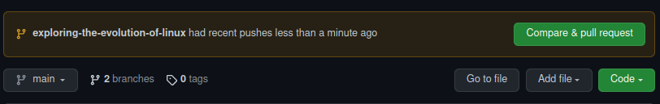

Pull requests are an excellent approach to communicating proposed code changes for review and receiving feedback from staff and other learners. This usually leads to dialogues and suggestions in the comments, which may lead to more code changes.

While comments and feedback are useful for enhancing code quality, they can easily be lost. To ensure that data isn't lost and a consistent system of record is created, it is worth noting that you are expected to REOPEN a closed Pull request if changes are requested. 

## Do not click Compare & pull request

After committing and pushing your changes and you are ready to get reviewed again, do not click on `Compare & pull request`. If you do this a new Pull request will be created and feedback comments will be lost. 

## How to reopen a closed pull request

- Open your project on GitHub and Click on `pull requests` 

- Click on `closed`

- Click on the pull request you want to reopen

- Scroll to the end of the page and click on `Reopen pull request`

## What if the pull request was merged

Once all your PRs are merged and your main branch looks like it's competent then you can move your card into the "review" column. At this point staff and peers can take a look at the final version of your code.

Sometimes you'll get more feedback at this point and you'll need to make more changes. 

When this happens then please don't attempt to re-open a merged pull request. Make a new PR with the new changes!

## Check your understanding!

- What is a pull request?
- Why is it important to reopen a closed pull request when changes are requested?
- What should you not do when you are ready to get reviewed again?
- What will happen if you click on Compare & pull request after committing and pushing your changes?
- What are the steps to reopen a closed pull request?
- What should you do if you get more feedback after your pull request has been merged?
- Can you reopen a merged pull request? Why or why not?