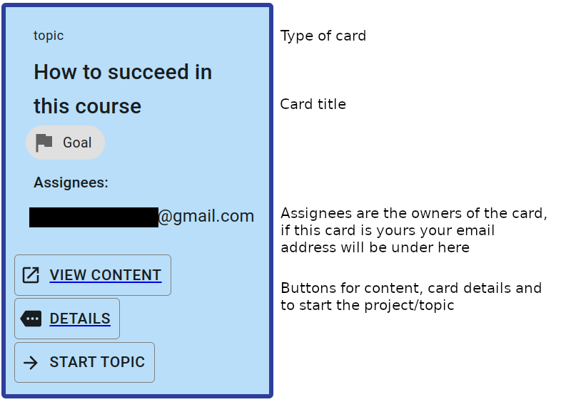
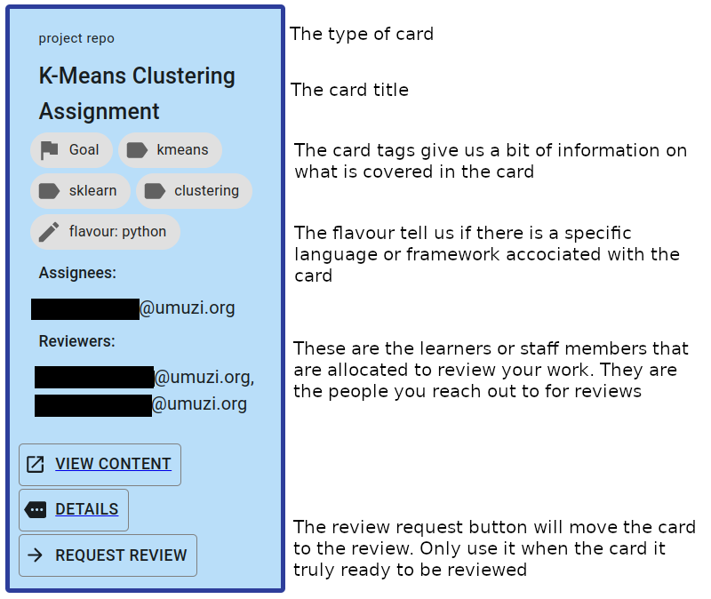
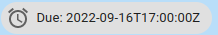
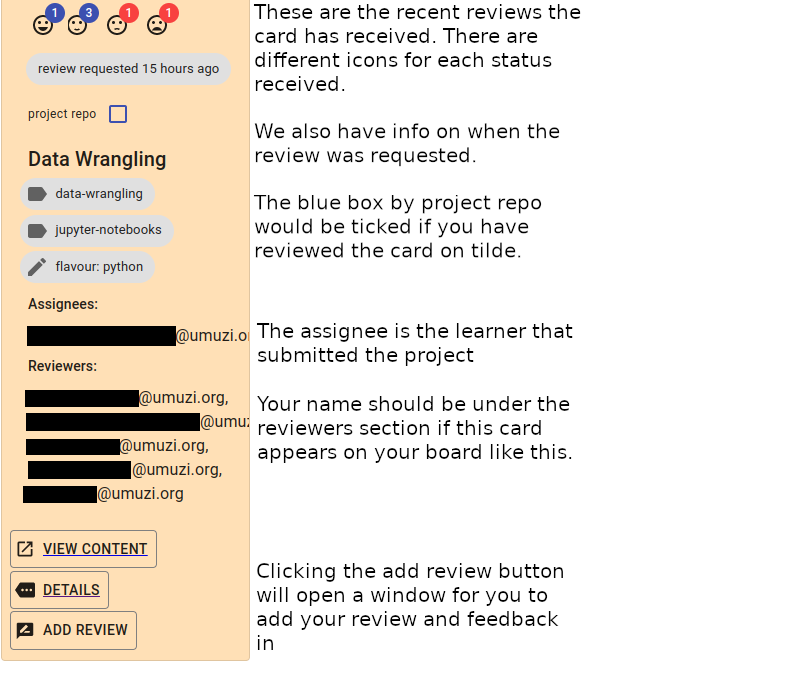

Now that you basically know what Tilde is, it's time to learn a bit more about how different kinds of cards _really_ work.

## How to build a successful career 

One REALLY HELLA IMPORTANT THING modern professional need to do is: Get really really good at mastering new concepts.

The rate of change in tech and tools is exponential. If you start a career and can't keep up with modern tools and techniques then you will become redundant. A machine will take your job.

The important thing to know at this point is that the people who are able to absorb the most knowledge and build mastery of skills are the people who will succeed. 

So pay attention! Read things carefully and assess your own understanding before moving forward. 

## Kinds of cards

There are 2 main kinds of cards. The different kinds of cards are associated with different kinds of activities, or different kinds of work that you need to do.

### Topic cards

A topic is something self-study. All you need to do is make sure that you understand the content. If it links to a tutorial, do the tutorial. If it links to an article or blog post, read it and **UNDERSTAND** it. Pretty straight-forward.

The general procedure for you is:

- choose to start the topic by clicking the relevant button;
- follow the link to the content and make sure you UNDERSTAND the material;
- choose to finish the topic by clicking the relevant button.

Once you say you are finished with a topic then the card will move into either the "Review" or "Complete" column.

Most topics will move straight to Complete, and others will need some kind of verification. For example, if a topic instructs you to go and do some external course, then when you say you are finished a staff member will double-check. They might ask you to prove that you worked through the course, they might give you a test to complete, they might just have a chat with you.

### Project cards

This is where the magic happens.

Projects are deliverables. We need to see you demonstrate your skills. By submitting projects you will move through the course and prove your competence.

Projects come in two different forms: **Link** projects and **Repo** projects. These behave a little different to each other. We'll go into detail and demonstrate those differences by actually doing a few projects and moving them to the complete column.

If you are learning to code, you'll be working a lot with repo projects. If you are not learning code (for example, if you are focusing on UX, business strategy, or something low-code) then you won't need to worry about repo projects.

Please take note that there is a "details" button on project cards, this links to a page where you can see information about your project submission and any feedback you've been given. As projects move forward through the board, they can be associated with all sorts of extra info. You will be able to view that information by clicking on "Details".

If there are no details to be displayed, there won't be a details button. The button will be displayed when it becomes useful.

## Deadlines

Some cards may have a deadline on them that looks something like the picture below. It is important that you get these to the `Complete` column. Aim to get them there before the deadline. This means that you need to account for receiving reviews, so you want to submit early so that you can get it complete in time. Deadlines are listed in GMT +2.

## Reviewing your peers

Giving good feedback is a skill, and learning to give and receive feedback are both essential to any professional. At some point, maybe earlier, maybe later, you will be required to give your peers feedback on some of their projects. When giving feedback it is essential to do this carefully and helpfully. This is an opportunity for growth for both you and the other learner. 

Remember, everyone here is here to learn and grow, any feedback you give or receive should be looked at through this lens.

IMPORTANT: If there is a card waiting for your review then it is always your top priority to review it. If everyone reviews their peers efficiently then everyone will benefit. Sitting around waiting for feedback is a terrible waste of time. 

## A note on prerequisites and ordering

Each card on your board represents a bit of work you need to do. Generally, the order of the cards in your backlog goes from least advanced to most advanced, and **you should try to do your work in roughly the order that the cards appear.**

However, it's your journey, so we want you to have as much freedom as possible in choosing what to do next. So if you want to start with the 5th card because it looks exciting, we are cool with that. Just please pay very close attention to any deadlines that have been set for you.

**Professionals meet deadlines and we want you to be a pro!**

We do have some restrictions in place:

1. You can't start a card that is too low down in the list because collaboration is hard if everyone is doing completely different things.
2. You can't have too many things in progress at the same time. Because multitasking is a lie. Seriously, it's just inefficient. Your priority should be to finish stuff. 
3. You can't start a card whose prerequisites have not been met. You'll see that some cards are greyed out and you can't start working on them. If you want to work on these cards you need to unblock them by Completing all their prerequisites.

## REALLY IMPORTANT

If you do a project and you think you did it well, then you get to ask for a review. When you ask for a review then the project card will move to the "Review" column. We'll practice this in a bit :)

Once you put the card into the review column, someone (or something 🤖) will mark your work. Now one of two things can happen:

If you did the work well, then it will get moved to the "Complete" column.

If the project is not up to our standards (yet) then it will get moved to the "Review Feedback" column. IF this happens:

- open up the card details page and read the feedback
- update your project so it's right
- ask for another review

You can ask for as many reviews as you need, but always do your best to apply all the feedback received before moving the card back to review.

If you put a card into the review column then you are saying "I did all the work that was described in the project brief and I think I am 100% competent". If you submit incomplete or broken work then you will always be told to finish and fix your work. Please be a professional here - hold yourself to a high standard.

## Check your understanding!

It's important to understand everything before you move forward. Test yourself with these quiz questions:

- What is the importance of mastering new concepts in modern careers?
- What are the two main types of cards in Tilde?
- How do you complete a topic card in Tilde?
- What is the purpose of project cards in Tilde?
- What are the two types of project cards in Tilde?
- What is the "Details" button on project cards used for?
- What should you do if a card has a deadline?
- Why is it important to review your peers' work in Tilde?