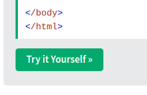

W3Schools does a great job of teaching the basics of HTML. Here is a tutorial to get you started:

[W3Schools - HTML Tutorial](https://www.w3schools.com/html/html_intro.asp)

For now it's ok if you just go over the section called "HTML Introduction". We'll be learning more later on in this challenge.

## Try it yourself

When you see buttons like this one then you should click them:

In order to learn to code, you need to learn to play with code. W3Schools is great because it gives you a way to play. 

You should be able to 
- edit the code
- run the code
- see the result of your code edits 

## Next up

The Try-it-yourself editor is a great playground and you can learn a lot from it. 

But it is not the right tool for the job if you want to do any serious web development. By the end of this challenge you will have your own website. That means we need to use the right tools for the job.

In the next section you'll learn to write code on your own device!

